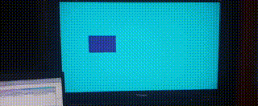
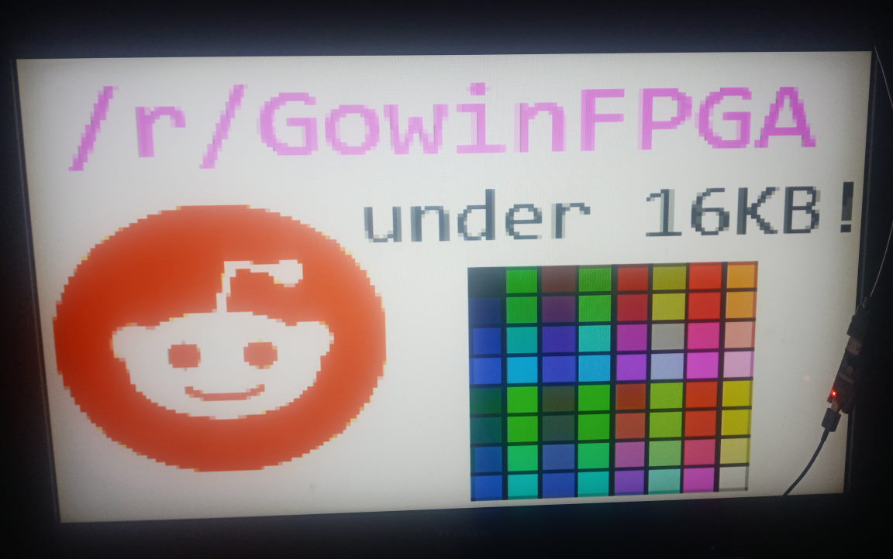

# nano4k_hdmi_tx
Open-source HDMI/DVI transmitter for the Gowin GW1NSR-powered Tang Nano 4K

Defaults to a 720x480@60Hz resolution, 24-bit color, currently transmitts a forwards-compatible DVI signal.

RTL written in Verilog with some help from Gowin's OSER10 blocks, includes demonstrations of various graphics:

## PAL bar test 
Set "pattern_generator_top.v" as top module.

## Bouncy box
Set "bouncy_box_top.v" as top module.

## SRAM Framebuffer
Set "sram_framebuffer_test_top.v" as top module.

